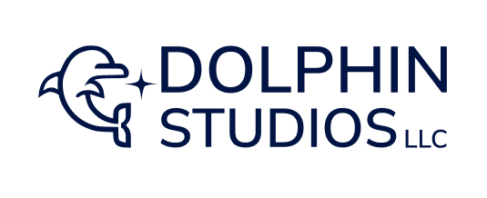

# Dolphin Studios LLC Rag App

<a href="https://dolphinstudios.co/"></a>

Welcome to the Dolphin Studios LLC!

## Installation

First, clone this repository to your local machine:

```bash
git clone https://github.com/apiispanen/rag-tool.git
```

Then, install the required packages:

```bash
cd rag-tool
pip install -r requirements.txt
```

## Usage

To start the application, run the following command:

```bash
py main.py
```

Navigate to the provided local URL in your web browser to interact with the demo.

## Features


## License

This project is licensed under the [Your License Name]. Please see the LICENSE file for more details.

## Contact

For any inquiries, feel free to visit our website at [Dolphin Studios](https://dolphinstudios.co).

<!-- 
---
title: Dolphin Demo App
description: Dolphin Studio's Demo Walkthrough
tags:
  - python
  - flask
  - WhisperAI
  - Langchain
  - MongoDB
--- -->

<!-- Copyright 2024 Dolphin Studios LLC -->
**Copyright 2024 Dolphin Studios LLC**

